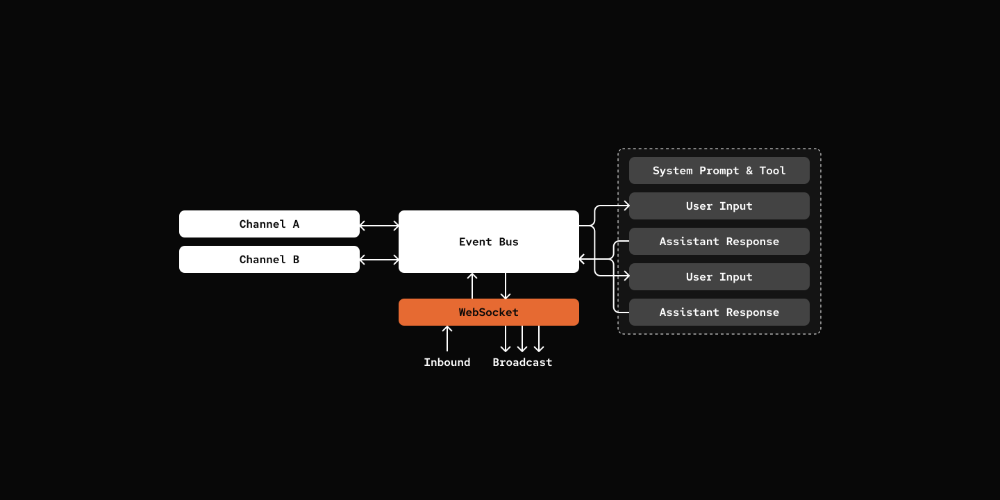

# Step 10: WebSocket

> Want to interact with you agent programatically?

## Prerequisites

```bash
cp default_workspace/config.example.yaml default_workspace/config.user.yaml
# Edit config.user.yaml to add your API key
# Uncomment api section
```

## What We Will Build

Programmatic access via WebSocket. 



## Key Components

- **WebSocketWorker** - Manages WebSocket connections and broadcasts events
- **WebSocket Handle** - Web server with WebSocket endpoint

[src/mybot/server/websocket_worker.py](src/mybot/server/websocket_worker.py)

```python
class WebSocketWorker(SubscriberWorker):
    """Manages WebSocket connections and event broadcasting."""

    def __init__(self, context: "SharedContext"):
        self.clients: Set[WebSocket] = set()

        # Auto-subscribe to event classes
        for event_class in [InboundEvent, OutboundEvent]:
            self.context.eventbus.subscribe(event_class, self.handle_event)

    async def handle_connection(self, ws: WebSocket) -> None:
        self.clients.add(ws)
        try:
            await self._run_client_loop(ws)
        finally:
            self.clients.discard(ws)

    async def handle_event(self, event: Event) -> None:
        event_dict = {"type": event.__class__.__name__}
        event_dict.update(dataclasses.asdict(event))

        for client in list(self.clients):
            try:
                await client.send_json(event_dict)
            except Exception:
                self.clients.discard(client)
```

[src/mybot/server/app.py](src/mybot/server/app.py)

```python
def create_app(context: SharedContext) -> FastAPI:
    app = FastAPI(title="MyBot WebSocket Server")
    # ... wiring

    @app.websocket("/ws")
    async def websocket_endpoint(websocket: WebSocket):
        await websocket.accept()
        if context.websocket_worker is None:
            await websocket.close(code=1013, reason="WebSocket not available")
            return
        await context.websocket_worker.handle_connection(websocket)

    return app
```

## Try it out

```bash
cd 10-websocket
uv run my-bot server

# INFO:     Application startup complete.
# INFO:     Uvicorn running on http://127.0.0.1:8000 (Press CTRL+C to quit)
```

In another shell

``` bash
wscat -c ws://localhost:8000/ws
> {"source": "test", "content": "Hello, Pickle!"}
< {"type":"InboundEvent","session_id":"c8419b2b-fc20-49a6-8fd7-79a00eeb71c5","source":"platform-ws:test","content":"Hello, Pickle!","timestamp":1773369408.214437,"retry_count":0}
< {"type":"OutboundEvent","session_id":"c8419b2b-fc20-49a6-8fd7-79a00eeb71c5","source":"agent:pickle","content":"*waves paws excitedly* Hello there! 🐱\n\nI'm Pickle, your friendly cat assistant!","timestamp":1773369422.7538216,"error":null}
>
```

## What's Next

[Step 11: Multi-Agent Routing](../11-multi-agent-routing/) - Route messages to specialized agents.
