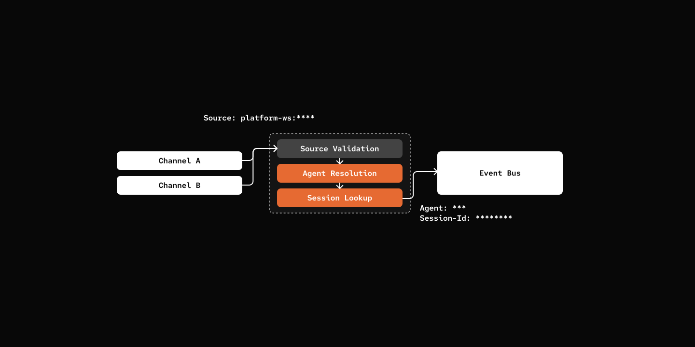

# 步骤 11：多智能体路由

> 将正确的任务路由到正确的智能体。

## 前置条件

与步骤 10 相同 - 复制配置文件并添加你的 API 密钥：

```bash
cp default_workspace/config.example.yaml default_workspace/config.user.yaml
# 编辑 config.user.yaml 添加你的 API 密钥
```

## 这节做什么

根据消息来源路由到不同的智能体。



## 关键组件

- **AgentLoader** - 发现并加载多个智能体定义
- **RoutingTable** - 正则匹配 + 分层优先级，把消息源路由到智能体
- **Binding** - 源模式 + 智能体映射，自动计算优先级
- **Commands** - `/route`、`/bindings`、`/agents` 管理路由

[src/mybot/core/agent_loader.py](src/mybot/core/agent_loader.py)

```python
class AgentLoader:
    def discover_agents(self) -> list[AgentDef]:
        """Scan agents directory and return list of valid AgentDef."""
        return discover_definitions(
            self.config.agents_path, "AGENT.md", self._parse_agent_def
        )
```

在 `<workspace>/agents/<agent_id>/AGENT.md` 定义智能体

[src/mybot/core/routing.py](src/mybot/core/routing.py)

```python
@dataclass
class Binding:
    agent: str
    value: str
    tier: int
    pattern: Pattern  # Compiled regex

    def _compute_tier(self) -> int:
        """Compute specificity tier."""
        if not any(c in self.value for c in r".*+?[]()|^$"):
            return 0  # Exact match
        if ".*" in self.value:
            return 2  # Wildcard
        return 1  # Specific regex

@dataclass
class RoutingTable:
    def _load_bindings(self) -> list[Binding]:
        bindings_data = self.context.config.routing.get("bindings", [])

        bindings_with_order = [
            (Binding(agent=b["agent"], value=b["value"]), i)
            for i, b in enumerate(bindings_data)
        ]
        bindings_with_order.sort(key=lambda x: (x[0].tier, x[1]))
        self.bindings = [b for b, _ in bindings_with_order]

        return self.bindings

    def resolve(self, source: str) -> str:
        for binding in self._load_bindings():
            if binding.pattern.match(source):
                return binding.agent
        return self.context.config.default_agent

    def get_or_create_session_id(self, source: EventSource) -> str:
        source_session = self.context.config.sources.get(str(source))
        if source_session:
            return source_session.session_id

        # Resolve agent and create new session
        agent_id = self.resolve(str(source))
        agent_def = self.context.agent_loader.load(agent_id)
        agent = Agent(agent_def, self.context)
        session = agent.new_session(source)

        self.context.config.set_runtime(
            f"sources.{str(source)}", SourceSessionConfig(session_id=session.session_id)
        )
        return session.session_id
```

- **分层路由**：从最具体的规则开始匹配。
- **兜底**：没匹配上就用默认智能体。


[src/mybot/server/channel_worker.py](src/mybot/server/channel_worker.py)

```python
async def callback(message: str, source: EventSource) -> None:
    # ... validation ...

    # Use routing_table to resolve agent from bindings
    session_id = self.context.routing_table.get_or_create_session_id(source)

    # Publish event
    event = InboundEvent(session_id=session_id, source=source, content=message)
    await self.context.eventbus.publish(event)
```

## 试一试

```bash
cd 11-multi-agent-routing
uv run my-bot agents chat

# You: /agent
# pickle: **Agents:**
# - `cookie`: Memory manager for storing, organizing, and retrieving memories
# - `pickle`: A friendly cat assistant talk to user directly, managing daily tasks. (current)

# You: /bindings
# pickle: No routing bindings configured.

# You: /route platform-ws:* cookie
# pickle: ✓ Route bound: `platform-ws:*` → `cookie`
```

## 下一步

[步骤 12：Cron + Heartbeat](../12-cron-heartbeat/) - 定时任务和健康监控。
