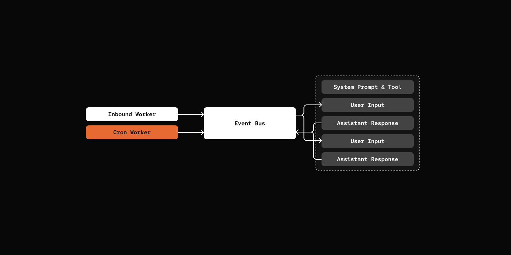

# 步骤 12：Cron + Heartbeat

> 智能体在你睡觉时工作。

## 前置条件

与步骤 09 相同 - 复制配置文件并添加你的 API 密钥：

```bash
cp default_workspace/config.example.yaml default_workspace/config.user.yaml
# 编辑 config.user.yaml 添加你的 API 密钥
```

## 这节做什么

定时任务——智能体按 cron 表达式自动跑。




## 关键组件

- **CRON.md & CronDef** - Cron 任务定义
- **CronWorker** - 每分钟检查待执行任务的后台工作器
- **DispatchEvent** - 内部任务调度的事件类型
- **DispatchResultEvent** - 调度任务返回的结果事件
- **Cron-Ops Skill** - 用于创建、列出和删除定时 cron 任务的技能（实现为技能以避免额外的工具注册）

[src/mybot/core/cron_loader.py](src/mybot/core/cron_loader.py)

```python
class CronDef(BaseModel):
    id: str
    name: str
    description: str
    agent: str
    schedule: str
    prompt: str
    one_off: bool = False
```

[src/mybot/server/cron_worker.py](src/mybot/server/cron_worker.py)

```python
class CronWorker(Worker):
    async def run(self) -> None:
        while True:
            await self._tick()
            await asyncio.sleep(60)

    async def _tick(self) -> None:
        jobs = self.context.cron_loader.discover_crons()
        due_jobs = find_due_jobs(jobs)

        for cron_def in due_jobs:
            event = DispatchEvent(
                session_id=session.session_id,
                source=CronEventSource(cron_id=cron_def.id),
                content=cron_def.prompt,
            )
            await self.context.eventbus.publish(event)
```

[default_workspace/crons/hello-world/CRON.md](../default_workspace/skills/cron-ops/SKILL.md)

Cron 操作功能使用 **SKILL 系统**实现，而不是注册专用工具，这避免了工具注册表的膨胀。

## 试一试

```bash
cd 12-cron-heartbeat
uv run my-bot server

# From Channel of your choice:

# You: Send me some Cat Meme every morning.
# pickle: I've scheduled a "Cat Meme" cron job you every morning 9 AM. You'll find those meme shortly! *purrs* 🐱
```

## CRON vs HEARTBEAT

- **HEARTBEAT**：只有一个，固定间隔跑，不管几点
- **CRON**：可以有多个，按 cron 表达式跑，精确到分钟

## 下一步

[步骤 13：多层提示](../13-multi-layer-prompts/) - 响应式系统提示。
