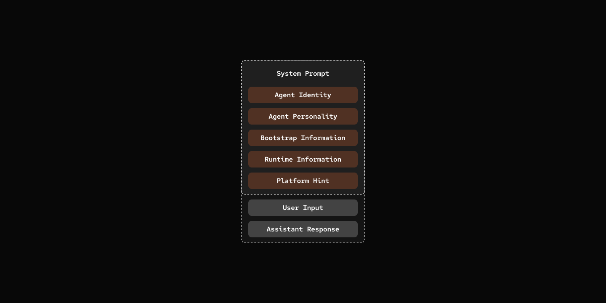

# 步骤 13：多层提示

> 更多上下文，更多上下文，更多上下文。

## 前置条件

与步骤 09 相同 - 复制配置文件并添加你的 API 密钥：

```bash
cp default_workspace/config.example.yaml default_workspace/config.user.yaml
# 编辑 config.user.yaml 添加你的 API 密钥
```

## 这节做什么

系统提示分多层组装：身份、性格、工作区上下文、运行时信息。



## 关键组件

- **AgentDef** - `soul_md` 扩展
- **PromptBuilder** - 将所有提示层组装成最终系统提示

[src/mybot/core/agent_loader.py](src/mybot/core/agent_loader.py)

```python
class AgentDef(BaseModel):
    id: str
    name: str
    description: str = ""
    agent_md: str
    soul_md: str = ""  # NEW: Personality layer (optional)
    llm: LLMConfig
    allow_skills: bool = False
```

[src/mybot/core/prompt_builder.py](src/mybot/core/prompt_builder.py)
```python
class PromptBuilder:
    def build(self, state: "SessionState") -> str:
        layers = []

        # Layer 1: Identity
        layers.append(state.agent.agent_def.agent_md)

        # Layer 2: Soul (optional)
        if state.agent.agent_def.soul_md:
            layers.append(f"## Personality\n\n{state.agent.agent_def.soul_md}")

        # Layer 3: Bootstrap context (BOOTSTRAP.md + AGENTS.md + crons)
        bootstrap = self._load_bootstrap_context()
        if bootstrap:
            layers.append(bootstrap)

        # Layer 4: Runtime context
        layers.append(self._build_runtime_context(agent_id, timestamp))

        # Layer 5: Channel hint
        layers.append(self._build_channel_hint(source))

        return "\n\n".join(layers)
```

### 示例工作区设置

- [default_workspace/agents/pickle/AGENT.md](../default_workspace/agents/pickle/AGENT.md) - 智能体身份、能力和行为准则（带有配置的 YAML 前言）
- [default_workspace/agents/pickle/SOUL.md](../default_workspace/agents/pickle/SOUL.md) - 定义智能体角色和语气的个性层
- [default_workspace/BOOTSTRAP.md](../default_workspace/BOOTSTRAP.md) - 描述目录结构、文件用途以及智能体、技能、cron 和记忆路径模板的工作区指南
- [default_workspace/AGENTS.md](../default_workspace/AGENTS.md) - 列出所有智能体，以及把任务调度给专用智能体（比如记忆操作）的模式


## 试一试

```bash
cd 13-multi-layer-prompts
uv run my-bot server

# From Channel of your choice:

# You: When are Where are we talking?
# pickle: Meow! Let me check... We're chatting right now via Telegram! *twitches ears*

# The current time is 2026-03-13 at 23:04:45. So we're here, in this conversation, happening in real-time. 🐱
```

## 扩展

架构可以按需加层。比如加个**记忆层**，注入历史对话的相关内容。

## 下一步

[步骤 14：主动发消息](../14-post-message-back/) - 智能体主动发起通信。
