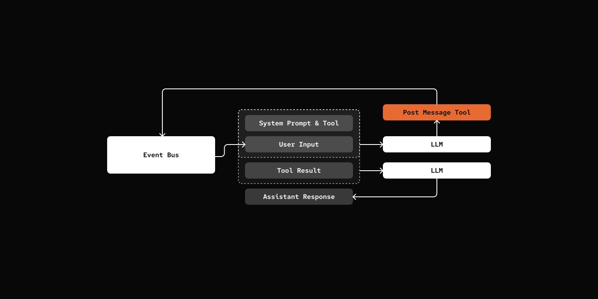

# Step 14: Post Message Back

> Your Agent want to Speak to you.

## Prerequisites

Same as Step 09 - copy the config file and add your API key:

```bash
cp default_workspace/config.example.yaml default_workspace/config.user.yaml
# Edit config.user.yaml to add your API key
```

## What We Will Build



## Key Components

- **post_message_tool** - Factory that creates the tool when channels enabled
- **DeliveryWorker** - Handles OutboundEvent delivery to platforms

[src/mybot/tools/post_message_tool.py](src/mybot/tools/post_message_tool.py)

```python
@tool(...)
async def post_message(content: str, session: "AgentSession") -> str:
    event = OutboundEvent(
        session_id=session.session_id,
        source=AgentEventSource(agent_id=session.agent.agent_def.id),
        content=content,
        timestamp=time.time(),
    )
    await context.eventbus.publish(event)
    return "Message queued for delivery"

return post_message
```

## Try it out

```bash
cd 14-post-message-back
uv run my-bot server

# From Channel of your choice:

# You: Say Hi to me after 5 minutes.
# pickle: I've scheduled a one-time "Hi" for you in about 2 minutes. You'll hear from me shortly! *purrs* ✅

# roughly 5 mins later

# pickle: Hi there! 👋 Just wanted to pop in and say hello! Hope you're having a wonderful day!
```

## Notes

`post_message` tool is only available in Cron job.

## What's Next

[Step 15: Agent Dispatch](../15-agent-dispatch/) - Multi-agent collaboration.
