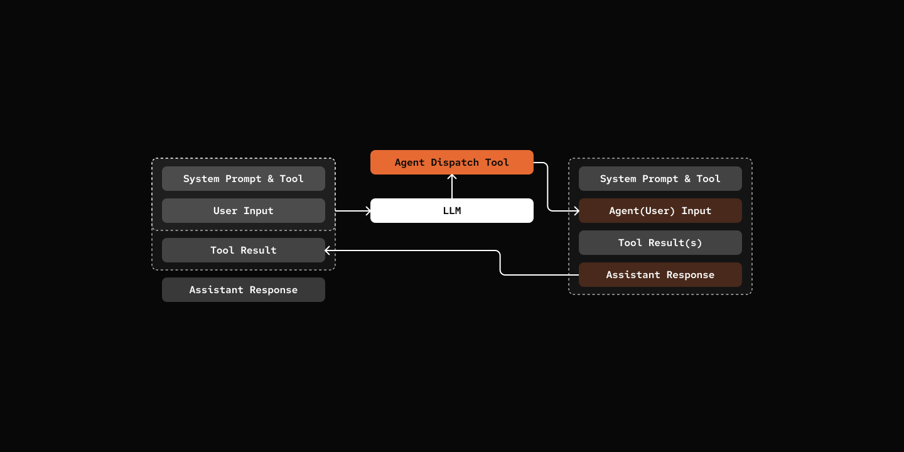

# 步骤 15：智能体调度

> 你的智能体想和朋友一起工作！

## 前置条件

与步骤 09 相同 - 复制配置文件并添加你的 API 密钥：

```bash
cp default_workspace/config.example.yaml default_workspace/config.user.yaml
# 编辑 config.user.yaml 添加你的 API 密钥
```

## 这节做什么

智能体可以把活派给其他智能体干。



## 关键组件

- **subagent_tool** - 创建调度工具的工厂，动态生成 schema

[src/mybot/tools/subagent_tool.py](src/mybot/tools/subagent_tool.py)

```python
def create_subagent_dispatch_tool(
    current_agent_id: str,
    context: "SharedContext",
) -> BaseTool | None:
    available_agents = context.agent_loader.discover_agents()
    dispatchable_agents = [a for a in available_agents if a.id != current_agent_id]

    agents_desc = "<available_agents>\n"
    for agent_def in dispatchable_agents:
        agents_desc += f'  <agent id="{agent_def.id}">{agent_def.description}</agent>\n'
    agents_desc += "</available_agents>"

    @tool(
        name="subagent_dispatch",
        description=f"Dispatch a task to a specialized subagent.\n{agents_desc}",
        parameters={...},
    )
    async def subagent_dispatch(
        agent_id: str, task: str, session: "AgentSession", context: str = ""
    ) -> str:
        agent_def = shared_context.agent_loader.load(agent_id)
        agent = Agent(agent_def, shared_context)
        agent_source = AgentEventSource(agent_id=current_agent_id)
        agent_session = agent.new_session(agent_source)
        session_id = agent_session.session_id

        user_message = task
        if context:
            user_message = f"{task}\n\nContext:\n{context}"

        loop = asyncio.get_running_loop()
        result_future: asyncio.Future[str] = loop.create_future()

        # Create temp handler that filters by session_id
        async def handle_result(event: DispatchResultEvent) -> None:
            if event.session_id == session_id:
                if not result_future.done():
                    if event.error:
                        result_future.set_exception(Exception(event.error))
                    else:
                        result_future.set_result(event.content)

        # Subscribe to DispatchResultEvent events
        shared_context.eventbus.subscribe(DispatchResultEvent, handle_result)

        try:
            event = DispatchEvent(
                session_id=session_id,
                source=AgentEventSource(agent_id=current_agent_id),
                content=user_message,
                timestamp=time.time(),
                parent_session_id=session.session_id,
            )
            await shared_context.eventbus.publish(event)

            response = await result_future
        finally:
            shared_context.eventbus.unsubscribe(handle_result)

        result = {"result": response, "session_id": session_id}
        return json.dumps(result)

    return subagent_dispatch
```

### 调度机制的工作原理

调度机制基于 **eventbus** 模式：

1. **发布**：主智能体调用 `subagent_dispatch`，向 eventbus 发送 `DispatchEvent`
2. **订阅**：临时处理器订阅 `DispatchResultEvent`，按 session ID 过滤
3. **等待**：主智能体等 future，子智能体完成后发布 `DispatchResultEvent`，future 解析
4. **清理**：收到结果后，处理程序从 eventbus 取消订阅。


## 试一试

```bash
cd 15-agent-dispatch
uv run my-bot chat

# You: Ask Cookie to read our README.
# pickle: Cookie has sent our README back! *purrs* 🐱

# # Step 15: Agent Dispatch

# > Your Agent want friends to work with!
# ...
```

## 注意

### 其他多智能体模式

直接调度不是唯一方式：

- **共享任务队列**：智能体从同一个队列领任务，互不直接对话
- **Tmux 技能**：给智能体一个 Tmux 技能，让它自己开多窗口干多件事

## 下一步

[步骤 16：并发控制](../16-concurrency-control/) - 速率限制和队列管理。
