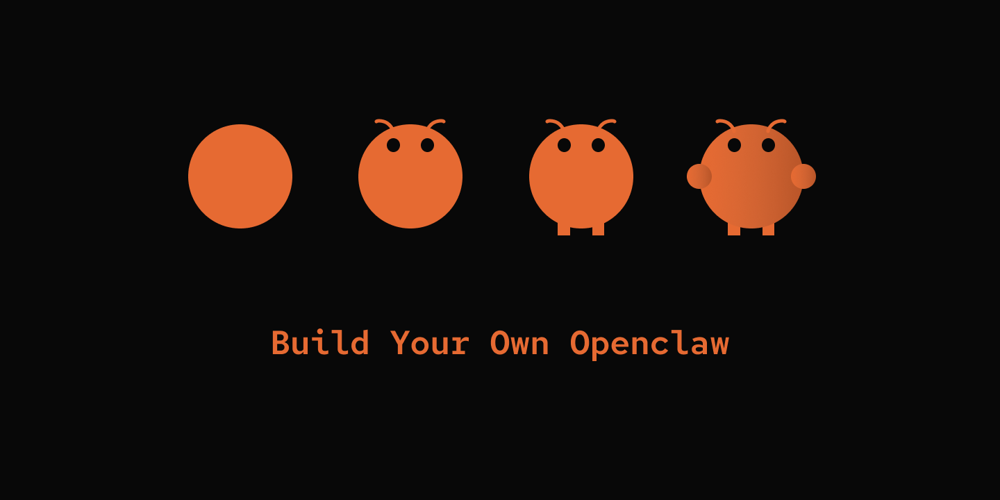

# Build Your Own OpenClaw (OAuth Edition)

A step-by-step tutorial to build your own AI agent, from a simple chat loop to a lightweight version of [OpenClaw](https://github.com/openclaw/openclaw). This edition targets **ChatGPT Plus and ChatGPT Pro subscriptions** — there is no API-key path.



## Quick Start

You need a ChatGPT Plus or Pro subscription. No OpenAI API key is required — this edition authenticates exclusively via the ChatGPT subscription OAuth flow.

**New to this?**
- Read [`OAUTH_EDITION_GUIDE.md`](OAUTH_EDITION_GUIDE.md) for a 10-minute architectural overview.
- Read [`OAUTH_DEEP_DIVE.md`](OAUTH_DEEP_DIVE.md) to understand PKCE, SSE, and the Responses API in depth.

1. **Copy the example config:**
   ```bash
   cp default_workspace/config.example.yaml default_workspace/config.user.yaml
   ```

2. **Log in once with your browser:**
   ```bash
   cd 00-chat-loop
   uv run my-bot login
   ```
   This opens `https://auth.openai.com/oauth/authorize` in your browser. After you sign in, tokens are saved to `~/.config/mybot/chatgpt_oauth.json` (POSIX) or `%APPDATA%\mybot\chatgpt_oauth.json` (Windows) with file mode `0600` on POSIX. Access tokens refresh automatically.

3. **Pick a model** in `default_workspace/config.user.yaml`. The accepted-model list lives in `default_workspace/models.yaml` — edit that file to add a newly-released id; no Python change needed.

4. **Run any step:**
   ```bash
   cd 00-chat-loop
   uv run my-bot chat
   ```
   Every step from `00-chat-loop` through `17-memory` reads the same Token_Store, so one login covers the whole tutorial.

## Overview

**18 progressive steps** teach you how to build a minimal version of OpenClaw. Each step includes:

- A `README.md` that walks through key components and design decisions.
- A runnable codebase.

**Example project:** [pickle-bot](https://github.com/czl9707/pickle-bot) — our reference implementation.

## Tutorial Structure

### Phase 1: Capable Single Agent (Steps 0–6)
Build a fully-functional agent that can chat, use tools, learn skills, remember conversations, and access the internet.

- [**00-chat-loop**](./00-chat-loop/) — Just a chat loop.
- [**01-tools**](./01-tools/) — Give your agent a tool.
- [**02-skills**](./02-skills/) — Extend your agent with `SKILL.md`.
- [**03-persistence**](./03-persistence/) — Save your conversations.
- [**04-slash-commands**](./04-slash-commands/) — Direct user control over sessions.
- [**05-compaction**](./05-compaction/) — Pack your history and carry on.
- [**06-web-tools**](./06-web-tools/) — Your agent wants to see the bigger world.

### Phase 2: Event-Driven Architecture (Steps 7–10)
Refactor to event-driven architecture for scalability and multi-platform support.

- [**07-event-driven**](./07-event-driven/) — Expose your agent beyond CLI.
- [**08-config-hot-reload**](./08-config-hot-reload/) — Edit without restart.
- [**09-channels**](./09-channels/) — Talk to your agent from your phone.
- [**10-websocket**](./10-websocket/) — Interact with your agent programmatically.

### Phase 3: Autonomous & Multi-Agent (Steps 11–15)
Add scheduled tasks, agent collaboration, and intelligent routing.

- [**11-multi-agent-routing**](./11-multi-agent-routing/) — Route the right job to the right agent.
- [**12-cron-heartbeat**](./12-cron-heartbeat/) — An agent that works while you are sleeping.
- [**13-multi-layer-prompts**](./13-multi-layer-prompts/) — More context, more context, more context.
- [**14-post-message-back**](./14-post-message-back/) — Your agent wants to speak to you.
- [**15-agent-dispatch**](./15-agent-dispatch/) — Your agent wants friends to work with.

### Phase 4: Production & Scale (Steps 16–17)
Reliability and long-term memory.

- [**16-concurrency-control**](./16-concurrency-control/) — Too many pickles running at the same time?
- [**17-memory**](./17-memory/) — Remember me.

## Model Allowlist

`default_workspace/models.yaml` is the authoritative list of model ids the ChatGPT subscription backend accepts for Codex. To pick a different model:

- Set `llm.model` in `config.user.yaml` to a value from `models.yaml`'s `allowed` list, or
- Add a newly-released id to `models.yaml` and then use it.

The file also supports a `patterns:` list of glob rules (default: `"*codex*"`), which matches newly-released `*-codex-*` variants without requiring a file edit.

## Pre-Pivot Multi-Provider Version

The earlier, multi-provider API-key version of the tutorial (Anthropic, Gemini, MiniMax, Grok, Z.ai, Qwen) lives in git history. It is not maintained alongside the OAuth Edition.

## Contributing

Each step is implemented in a separate session. Suggestions welcome.
